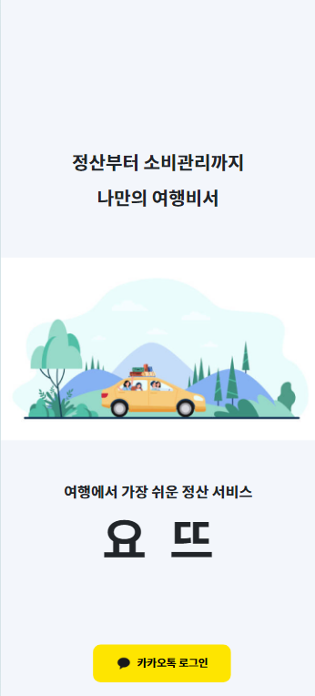
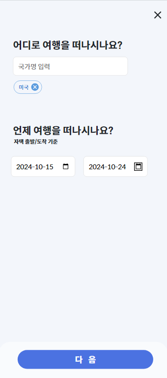
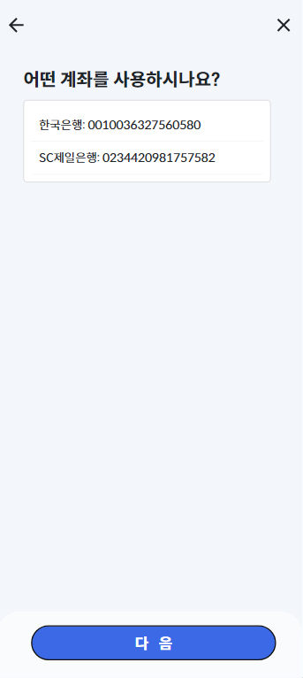
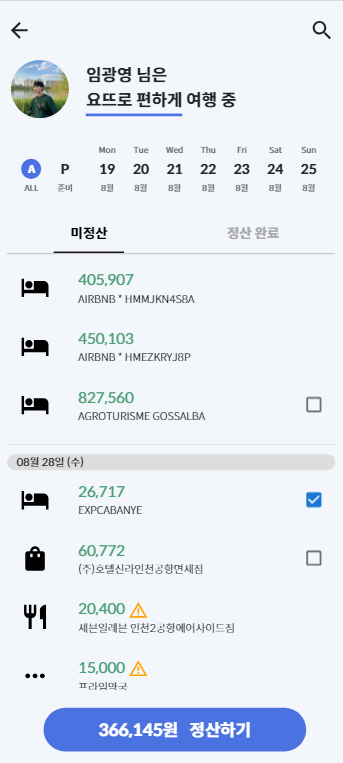
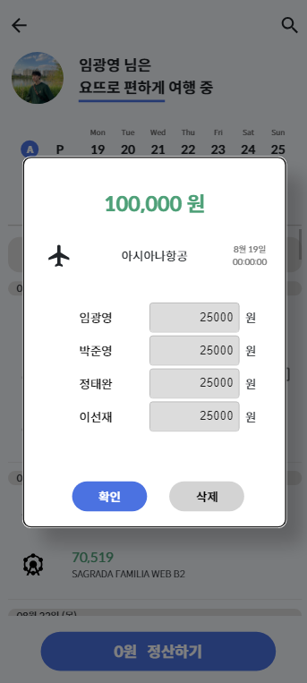
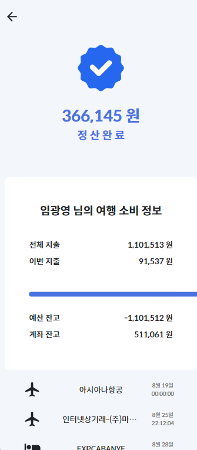
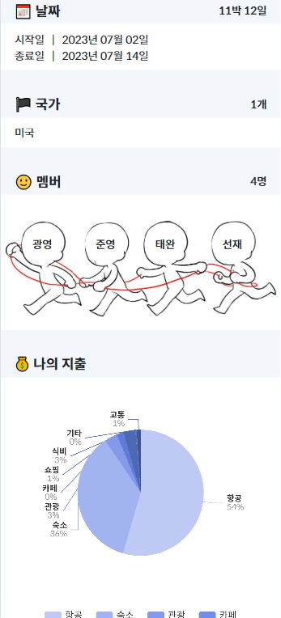
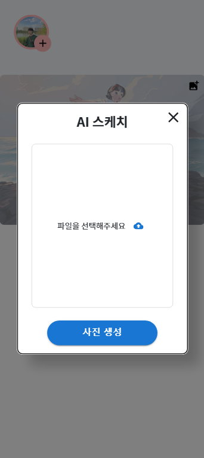

# 요뜨

## 개발 환경

- **언어:** Python, JavaScript
- **프레임워크:** Django, React.js
- **IDE:** Visual Studio Code
- **데이터베이스:** MySQL
- **버전 관리:** Git
- **빌드 및 배포 도구:** Docker, Jenkins

## 빌드 및 실행 방법

#### Django 실행 방법

1. `back` branch로 이동: `git switch back`
2. 가상환경 생성: `python -m venv venv`
3. 가상환경 활성화: `source venv/Scripts/activate`
4. 라이브러리 설치: `pip install -r requirements`
5. Django 서버 실행: `python manage.py runserver`

#### React.js localhost 빌드 방법

1. `develop-front` branch로 이동: `git switch develop-front`
2. Frontend 폴더로 이동: `cd front/Frontend`
3. 라이브러리 설치: `npm install`
4. React.js 서버 실행: `npm run dev`

## 프로젝트 흐름 설명

### 1. 시작 페이지(HomePage)

- Kakao 소셜 로그인과 연동했습니다.

### 2. 전체 여행 페이지(TripPage)

- 사용자의 전체 여행을 보여주는 페이지입니다.
- 상단의 여행은 현재 진행중인 여행, 그리고 미래에 갈 여행을 보여줍니다.
- 하단의 여행은 완료된 여행들을 보여줍니다.
- 특히, 하단의 여행 썸네일은 사용자가 업로드한 사진을 생성형 AI를 활용하여 스케치 형식의 이미지로 변환한 것입니다.

### 3. 여행 생성 페이지(TripCreatePage)

- 이 페이지는 여행을 생성하는 페이지입니다.
- 모든 내용이 조건을 충족한다면 다음 버튼 클릭 시 여행이 생성됩니다.
- 상세 여행 페이지로 돌아가게 되고, 생성된 여행을 확인할 수 있습니다.

### 4. 여행 상세 페이지(TripDetailPage)

- 여행의 꽃, 결제 내역을 표기해주는 페이지입니다.
- 상단의 날짜를 클릭하면 해당 날짜의 결제 내역을 보여주고, 좌측의 A를 클릭하면 모든 결제 내역을 표기해줍니다.
- P를 클릭하면 여행 전 결제 내역이 표기되고, 결제 내역을 추가할 수 있습니다.
  - 항공, 숙박과 같은 경우 여행 전에 미리 결제하는 경우가 많아 결제 내역 추가 기능을 제공합니다.
- 예산은 초기, 잔여, 소비 예산을 보여줍니다. 예산 부분을 클릭하면 보여지는 정보가 달라지는 것을 볼 수 있습니다.
- 하단 결제에서는 자신이 결제한 결제 내역에 대해서만 정산할 수 있도록 설정했고, 정산이 완료되면 회색으로 표기됩니다.

### 5. 여행 종료 페이지(TripFinishView)

### 9. 완료된 여행 페이지(GalleryView)

- 이미 다녀온 여행의 기록을 볼 수 있는 페이지입니다.
- 여행의 날짜와 멤버, 소비 내역을 볼 수 있습니다.
- 여행 소비 내역을 자동으로 카테고리화하여 분류하며, 이에 따라 소비 성향을 분석하여 사용자의 소BTI를 알려줍니다.
- 여행 스케치 기능을 통해 사용자의 여행 사진를 입력하면, 생성형 AI가 사진을 스케치해줍니다.